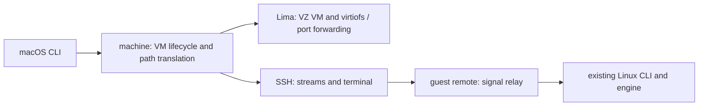
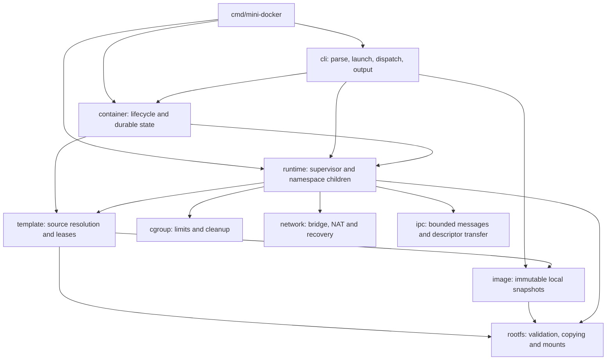

# Architecture

[Quick start](README.md) · [Usage](guides/usage.md) · [Development](guides/development.md)

mini-docker is a macOS host application with an embedded Linux guest engine.
It separates VM management and host transport from command handling, durable
container management, runtime supervision, and Linux resource adapters. The public CLI and versioned container
records remain stable while these internal responsibilities evolve.

## macOS host and Linux guest

The public Darwin build embeds a native-architecture Linux build of the same
engine entry point. The Darwin CLI validates arguments, supplies the built-in
BusyBox default, and dispatches to `internal/machine`; the Linux CLI continues
to execute inside the guest. Linux is an internal component, not a supported
public host installation target.

`machine` serializes creation, startup, and engine installation using a host
file lock. It owns the `mini-docker-runtime` instance configuration and embeds
the engine plus the rootfs preparation helper. The payload hash determines
whether an engine update is needed. Installation atomically replaces the guest
executable and preserves the Linux container/image stores. The writable Mac
home share provides installation staging and live bind sources; persistent
container roots remain on the Linux disk.

Engine caching is independent of builtin template health. A private guest
installation operation checks the template's layout, applet links, permissions,
architecture, and recorded BusyBox checksum. Repairs generate and validate a
private sibling tree before a Linux rename exchange publishes it atomically.
The template module owns a stable lease outside the exchanged directory: source
copies hold it shared, and repair holds it exclusively. Runtime releases the
copy lease once its private root is ready, so running workloads do not delay
repair. Interrupted staging trees are reclaimed under the exclusive lease;
symlinks, unsafe directory ownership/permissions, and mounts block reclamation.

SSH carries exact shell-quoted argv, standard streams, exit status, and PTYs.
`remote` owns per-session Unix datagram sockets in private guest directories,
relays control signals to the CLI child, and removes sockets when sessions end.
A small macOS watchdog inherits a private lifeline pipe. Normal completion
sends a marker; abrupt client death closes the pipe without that marker, and
the watchdog sends a hangup to the guest session. SSH keepalives bound broken
connections. Guest parsing supplies guest UID/GID defaults for rootless commands.
Isolation re-execution modes remain guest-local; the watchdog is host-local.

Published Mac wildcard and localhost addresses translate to dedicated guest
loopback addresses. Lima forwards only those addresses using its gRPC forwarder
for TCP and UDP; the Linux network adapter continues to own NAT and port leases.
Lima owns host forwarding cleanup. The host checks occupied ports before launch,
but cannot reserve Lima's eventual socket atomically.

## Module boundaries

The diagram shows the main startup dependencies; `config` supplies shared
execution data and validation. Container inspection also reads cgroup metrics,
while managed exec uses runtime resources and IPC.

| Package | Owns | Keep out |
| --- | --- | --- |
| `cmd/mini-docker` | Process entry and private re-exec modes | Parsing and lifecycle policy |
| `cli` | Flags, privilege/delegation launch, signal contexts, presentation | Persistent state and Linux isolation |
| `config` | Serializable execution values and validation | CLI output and resource allocation |
| `container` | Records, generations, operation locks, systemd services, logs, inspection | Namespace setup and workload execution |
| `runtime` | Startup handshake, PID 1, signals, exec sessions, run recovery and cleanup | User-facing command parsing and container records |
| `template` | Directory/image selection, canonical validation, image lease ownership | Copies, mounts, and lifecycle state |
| `image` | Content identity, atomic import, integrity checks and deletion leases | Runtime supervision |
| `rootfs` | Confined filesystem access, copying, mounts and DNS files | Image lookup and container management |
| `cgroup`, `network`, `ipc` | Their Linux resource/protocol operations | CLI and durable lifecycle policy |

Within `cli`, `parse_*.go` handles command families, `commands_*.go` executes
operations with a caller-provided context, `management.go` handles cancellation
and exit status, and `output.go` handles table/JSON rendering. `help.go` is the
option reference. Parsing completes before privilege escalation.

Within `runtime`, `check_linux.go` probes capabilities, `protocol_linux.go`
defines supervisor/init messages, and `filesystem_linux.go` prepares private
roots. `runtime_linux.go` coordinates startup and supervision; `init_linux.go`
runs in the namespaces. Existing terminal, exec, security, and recovery files
remain responsible for their respective operations.

## Execution and ownership

Foreground: parse → privilege/delegation setup → acquire template → capability
checks → prepare private root → allocate resources → start init → authorize
workload → supervise → clean up.

Detached: create a durable record → launch a systemd supervisor → follow the
same runtime path → record completion. Observer events connect runtime progress
to durable state without making runtime depend on container storage. Managed
exec receives pinned namespace, root, executable, and cgroup resources through
the existing executor contract.

| Resource | Owner and lifetime |
| --- | --- |
| Template/image lease | `template.Template`; builtin copy leases release after copying, image leases close after use. Failure closes before returning. Other directory templates must stay stable while copying. |
| Transient root and run directory | Runtime; removed after workload cleanup, or preserved when safe cleanup cannot be established. |
| Retained root | Container store; reused on start/restart and removed by `rm`. Runtime stages, syncs, and atomically publishes the first copy. |
| Cgroup and network allocation | Runtime coordinates adapter cleanup and preserves recovery receipts when needed. |
| Exec descriptors and sessions | Runtime/executor; closed before disk cleanup. Workloads join their resource group before execution. |
| Records, log files, operation locks | Container store/supervisor; lifecycle mutations remain serialized. |

Restart validates an existing retained root without reopening its original
template or image. This preserves container writes and permits restart after
the source directory disappears. Temporary mounts and execution resources are
fresh for each generation. Image acquisition must protect the source until a
copy or durable reference exists; do not reverse image/container lock ordering.

## Extending the project

- New CLI options: parse in the command family, validate shared semantics in `config`, then pass values to the owning module. Keep help and usage examples consistent.
- New lifecycle operations: add container-store behavior and generation/locking rules first, then expose a CLI handler. Preserve recovery and previous-execution receipts.
- New isolation features: add a Linux adapter or runtime step with explicit resource ownership, rollback, and unsupported-platform behavior.
- New storage sources: extend template resolution while preserving leases and canonical source/bind validation; keep copying in `rootfs`.

Use unit tests for invalid inputs, cancellation, and failure cleanup; validate
runtime changes with privileged integration tests in the dedicated Linux VM.
No new framework or global service registry is needed to add a command or adapter.
