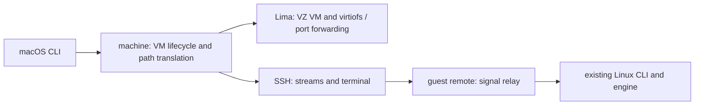
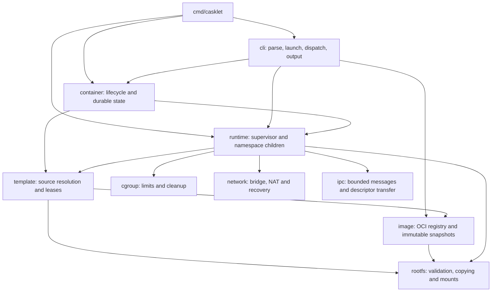

# Architecture

[Quick start](README.md) · [Usage](guides/usage.md) · [Development](guides/development.md)

casklet is a macOS host application with an embedded Linux guest engine.
It separates VM management and host transport from command handling, durable
container management, runtime supervision, and Linux resource adapters. The public CLI and versioned container
records remain stable while these internal responsibilities evolve.

## macOS host and Linux guest

The public Darwin build embeds a native-architecture Linux build of the same
engine entry point. The Darwin CLI validates arguments, supplies the built-in
BusyBox default, and dispatches to `internal/machine`; the Linux CLI continues
to execute inside the guest. Linux is an internal component, not a supported
public host installation target.

`machine` serializes creation, startup, and engine installation using a host
file lock. It owns the `casklet-runtime` instance configuration and embeds
the engine plus the rootfs preparation helper. The payload hash determines
whether an engine update is needed. Installation atomically replaces the guest
executable and preserves the Linux container/image stores. The writable Mac
home share provides installation staging and live bind sources; persistent
container roots remain on the Linux disk.
The reuse check verifies the installed executable's SHA-256 as well as the
version marker, so executable corruption triggers atomic reinstallation before
guest engine execution.

Engine caching is independent of builtin template health. A private guest
installation operation checks the template's layout, applet links, permissions,
architecture, and recorded BusyBox checksum. Repairs generate and validate a
private sibling tree before a Linux rename exchange publishes it atomically.
The template module owns a stable lease outside the exchanged directory: source
copies hold it shared, and repair holds it exclusively. Runtime releases the
copy lease once its private root is ready, so running workloads do not delay
repair. Interrupted staging trees are reclaimed under the exclusive lease;
symlinks, unsafe directory ownership/permissions, and mounts block reclamation.

SSH carries exact shell-quoted argv, standard streams, exit status, and PTYs.
`remote` owns per-session Unix datagram sockets in private guest directories,
relays control signals to the CLI child, and removes sockets when sessions end.
A small macOS watchdog inherits a private lifeline pipe. Normal completion
sends a marker; abrupt client death closes the pipe without that marker, and
the watchdog sends a hangup to the guest session. SSH keepalives bound broken
connections. Guest parsing supplies guest UID/GID defaults for rootless commands.
Isolation re-execution modes remain guest-local; the watchdog is host-local.

Published Mac wildcard and localhost addresses translate to dedicated guest
loopback addresses. Lima forwards only those addresses using its gRPC forwarder
for TCP and UDP; the Linux network adapter continues to own NAT and port leases.
Lima owns host forwarding cleanup. The host checks occupied ports before launch,
but cannot reserve Lima's eventual socket atomically.
For retained containers, a private lifecycle handshake checks saved published
ports after the guest stops the old execution. The guest holds the immutable
container's operation lock throughout stopping, host authorization, and startup.
The host briefly waits for Lima to release old sockets, checking wildcard ports
against local IPv4 addresses too. Refusal, disconnection, or cancellation leaves
the stopped generation intact. An already running `start` needs no check.

## Module boundaries

The diagram shows the main startup dependencies; `config` supplies shared
execution data and validation. Container inspection also reads cgroup metrics,
while managed exec uses runtime resources and IPC.

| Package | Owns | Keep out |
| --- | --- | --- |
| `cmd/casklet` | Process entry and private re-exec modes | Parsing and lifecycle policy |
| `cli` | Flags, privilege/delegation launch, signal contexts, presentation | Persistent state and Linux isolation |
| `config` | Serializable execution values and validation | CLI output and resource allocation |
| `container` | Records, generations, operation locks, systemd services, logs, health monitoring, inspection | Namespace setup and workload execution |
| `runtime` | Startup handshake, PID 1, signals, exec sessions, run recovery and cleanup | User-facing command parsing and container records |
| `template` | Directory/image selection, canonical validation, image lease ownership | Copies, mounts, and lifecycle state |
| `image` | Registry resolution, platform selection, layer application, startup defaults, content identity, atomic publication and deletion leases | Runtime supervision |
| `volume` | Private volume metadata, usage leases, tar streams, staged restore publication | Container lifecycle and host paths |
| `rootfs` | Confined filesystem access, copying, mounts and DNS files | Image lookup and container management |
| `cgroup`, `network`, `ipc` | Their Linux resource/protocol operations | CLI and durable lifecycle policy |

Within `cli`, `parse_*.go` handles command families, `commands_*.go` executes
operations with a caller-provided context, `management.go` handles cancellation
and exit status, and `output.go` handles table/JSON rendering. `help.go` is the
option reference. Parsing completes before privilege escalation.

Within `runtime`, `check_linux.go` probes capabilities, `protocol_linux.go`
defines supervisor/init messages, and `filesystem_linux.go` prepares private
roots. `runtime_linux.go` coordinates startup and supervision; `init_linux.go`
runs in the namespaces. Existing terminal, exec, security, and recovery files
remain responsible for their respective operations.

## Execution and ownership

Foreground: parse → privilege/delegation setup → acquire template → capability
checks → prepare private root → allocate resources → start init → authorize
workload → supervise → clean up.

Detached: create a durable record → launch a systemd supervisor → follow the
same runtime path → record completion. Observer events connect runtime progress
to durable state without making runtime depend on container storage. Managed
exec receives pinned namespace, root, executable, and cgroup resources through
the existing executor contract.

| Resource | Owner and lifetime |
| --- | --- |
| Template/image lease | `template.Template`; builtin copy leases release after copying. Image-backed overlays retain the lower image lease in both supervisor and init through namespace use; workload exec closes inherited lease descriptors. Other directory templates must stay stable while copying. |
| Transient root and run directory | Runtime; removed after workload cleanup, or preserved when safe cleanup cannot be established. |
| Retained root | Container store; reused on start/restart and removed by `rm`. Runtime stages, syncs, and atomically publishes a copied tree or a versioned overlay storage envelope. |
| Cgroup and network allocation | Runtime coordinates adapter cleanup and preserves recovery receipts when needed. |
| Exec descriptors and sessions | Runtime/executor; closed before disk cleanup. Workloads join their resource group before execution. |
| Records, log files, operation locks | Container store/supervisor; lifecycle mutations remain serialized. |

Restart validates an existing complete copied root without reopening its original
source. Overlay roots instead validate a private envelope and matching immutable
image ID, then reacquire the lower image. Both preserve container writes, and
directory copies still permit restart after their source disappears. Temporary
mounts and execution resources are fresh for each generation. Image acquisition
must protect the lower throughout overlay use or until a copy/durable reference
exists; do not reverse image/container lock ordering.

The boot-enabled `casklet-restarts.service` owns automatic policy reconciliation.
It uses the same per-container operation lock and start path as manual lifecycle
commands, with four bounded concurrent operations and fair polling. Workload
units keep `Restart=no`; every attempt publishes a new durable generation and
receipt. Retry count, backoff deadline, and manual-stop state survive manager
replacement. Boot identities distinguish policy restoration from a manual stop
in the current boot. Manual stop records suppression before signalling, and
manual start/restart clears it only when an execution is published. Preparation
failures consume retries without inventing an execution. Guest automatic starts
have no Mac port preflight; forwarding remains Lima's responsibility. Engine
installation enables the manager and replaces it independently of workloads.

Log rotation and snapshots use a per-container `.logs` lock. Lookup and lock
acquisition briefly use the metadata lock; waiting and log I/O do not. Removal
claims the log lock before hiding a record. A bounded lock timeout discards only
the current capture chunk, records truncation and a diagnostic, then continues
capturing later output. Permanent storage errors still drain the pipe so output
failure cannot indefinitely block the workload.
Active supervisors from an older engine keep using the metadata lock; readers
honor that protocol until completion or a new supervisor enables log locking.

Runtime cleanup returns typed failures without changing the command's exit
code. The supervisor stores sanitized `cleanup_failures` stages in both the
record and its execution receipt, and detailed diagnostics in the private error
field and logs. Public inspection exposes stages without private error text.
Restart clears current failures and retains the previous execution's stages.
Failed cgroup emptying or removal preserves the run directory and its recovery
receipt. Foreground CLI invocations report infrastructure errors as status 125
when the command would otherwise return zero.

Opening, creating, listing, and removing container records opportunistically
recover abandoned `.create-ID` and `.remove-ID` directories. Recovery checks
private ownership, existing leases, and mount points. A stable `.transactions`
lock outside those directories fences deletion after internal lock files have
been unlinked. Live deletion causes opportunistic recovery to skip; recursive
deletion runs after releasing the metadata lock. Unsafe artifacts are preserved
with an error, and unknown directory names are left alone.

## Extending the project

- New CLI options: parse in the command family, validate shared semantics in `config`, then pass values to the owning module. Keep help and usage examples consistent.
- New lifecycle operations: add container-store behavior and generation/locking rules first, then expose a CLI handler. Preserve recovery and previous-execution receipts.
- New isolation features: add a Linux adapter or runtime step with explicit resource ownership, rollback, and unsupported-platform behavior.
- New storage sources: extend template resolution while preserving leases and canonical source/bind validation; keep copying in `rootfs`.

Use unit tests for invalid inputs, cancellation, and failure cleanup; validate
runtime changes with privileged integration tests in the dedicated Linux VM.
No new framework or global service registry is needed to add a command or adapter.

## OCI images

The guest image adapter uses go-containerregistry for OCI/Docker registry transport,
anonymous token challenges, manifest lists, and compression. It does not invoke
Docker Engine. Downloads select the native Linux platform and verify each layer's
uncompressed digest before applying it to a private staging root. Whiteouts precede
same-layer additions. Root-confined operations interpret absolute symlinks relative
to the image, never the host. Unsupported special files fail the transaction.

Image records contain execution defaults and the source manifest digest; the local
content identity also covers numeric ownership and defaults. Atomic reference files
map normalized registry names to immutable local IDs. Pull refreshes references;
run reuses a cached reference. Private leased transactions prepare pulls/imports
outside the global image lock. Stable per-reference locks serialize refreshes
before remote resolution; global locking protects staging creation, recovery
claims, short publication/reference updates, and deletion claims. A shared
per-image lease pins content while full verification runs outside the global
lock. Stable external transaction locks fence recursive staging cleanup after
internal lease unlinking.
Deletion validates the image lease, container references, and mount state before
atomically renaming the image to a random `.delete-` tombstone under the global
lock. Its exclusive `.transaction-.delete-` lock is created before the rename and
held through cleanup and directory syncing. Recursive removal runs outside the
global lock, checks cancellation, and uses pinned directories with no-follow,
no-cross-mount child opens. Recovery claims at most 32 abandoned transactions per
batch under the global lock, then cleans them outside it. Legacy `.import-` and
`.remove-` trees migrate to the new deletion protocol; older engines ignore the
new tombstones. Failures retain recoverable storage, and active external owners
remain protected even when their internal `.lease` file is already gone.
The `.blobs` subdirectory caches compressed layers by digest. Stable per-digest
locks serialize download/publication and hold shared usage leases through ordered
extraction. Three workers per pull fetch distinct blobs; errors cancel and join
workers before image staging closes. Manifest digest/size checks precede atomic
blob publication, and cache hits hash the pinned file again. DiffIDs and whiteouts
remain checked/applied in manifest order. Prune skips active blob leases and clears
idle blobs independently of unpacked image references. The cache is not part of
the local image identity, and unpacked roots remain independent across images.
Network preparation precedes workload startup deadlines.
Operation-scoped image observers emit layer phases and throttled byte counts from
compressed streams and archive reads. The CLI owns rendering on stderr, preserving
stdout results. The Mac resolves automatic progress mode before SSH dispatch; no
PTY or output-stream merging is needed for detached runs or explicit image pulls.

Template resolution holds an image lease while merging defaults and publishing a
durable reference or acquiring the runtime source. Container records store the local
ID and fully merged configuration. New privileged image roots use a private
versioned `rootfs.overlay` envelope beside the legacy `rootfs` path, containing
the lower ID and upper/work directories. Metadata therefore cannot collide with
files inside existing copied container roots. Init makes
mount propagation private, mounts the merged OverlayFS view at the transient run
root using pinned directory descriptors, validates it, then prepares workdir/DNS
before pivoting. The merged mount never appears in the guest host namespace.
Overlay metadata copy and directory redirects are disabled. Legacy copied roots,
directory sources, and user-namespace modes retain their copy path. Init inherits
the lower image usage lease so supervisor loss cannot authorize deletion while its
namespace survives. Runtime preserves image ownership, creates a missing working
directory, mounts private shared memory, and applies
the bounded OCI root capability policy needed by application entrypoints. Builtin
BusyBox health checks remain strict; generic filesystem validation requires neither
BusyBox nor static linking. Restart uses the retained root and saved configuration.

## Named data volumes

`volume` owns private metadata, data directories, creation/removal transactions,
and shared usage leases. Mount configuration stores volume names rather than host
paths. `rootfs` pins the corresponding guest data directory for bind installation.
Runtime holds a usage lease through cleanup and passes it to init with close-on-exec,
so abrupt supervisor death does not release an active namespace's lease. Detached
creation holds leases until records provide durable references. Removal acquires
an exclusive lease and checks all container configurations. Lock order is volume
store then container store; lifecycle operations never acquire volume locks while
holding container metadata locks. User namespaces are currently excluded.

Volume tar export holds an exclusive usage lease without requiring retained
references to disappear. Restore extracts to leased private staging outside the
global volume lock, validates a complete bounded archive, fsyncs it, and publishes
a new name under that lock. Transaction recovery skips leased staging. The CLI
uses stdout/stdin streams, so macOS archives need no filesystem share.

## Guest disk accounting

`storage` measures allocated blocks using pinned no-follow directories and
`openat2` mount-boundary checks. It counts hardlinks once per category and skips
vanished entries during live writes. `image.Prune` snapshots IDs, then checks each
candidate under the existing deletion lock/lease/reference protocol. The CLI owns
preview selection and presentation; disk reporting never deletes workloads or
volumes. Filesystem availability covers the guest OS disk, while category totals
cover only casklet storage and exclude host shares.

## Container health

Image launch defaults retain the Docker Healthcheck extension and custom shell;
raw config decoding preserves StartInterval independently of registry-library
coverage. Config owns validated probe tests, timing defaults, and field overrides.
Each detached supervisor starts one monitor after publishing command startup.
The monitor uses pinned exec resources, a dedicated child cgroup, and immediate
deadline/cancellation kills. It finishes before exec descriptors or workload
resources close. Generation-fenced state updates retain five bounded results,
without probe output. Container inspection separates health from lifecycle state;
restart resets health while retaining configuration. Foreground execution has no
durable health monitor. Health transitions do not change restart policy.
Readiness waits resolve an immutable ID and generation once, then sample the saved
health state on a cancelable timer while recovering stale supervisor state through
the existing lifecycle path. They hold no lifecycle lock between samples, schedule
no probes, and fail on stop, removal, or generation changes. The CLI owns the
30-second default deadline and maps readiness timeout to status 124 without
changing the workload. Ordinary exit waits continue reading generation receipts.

## Named networks and scoped DNS

`network` owns guest-local named metadata, stable store/deletion lease files,
per-execution allocation journals, bridges, and scoped DNS transport. `container`
checks retained references and reserves exact names/aliases atomically under its
metadata lock. Creation acquires the network lease before publishing the retained
config; runtime holds a lease through execution cleanup. Removal acquires the
network store lock and exclusive lease before scanning containers, then takes
the existing network allocation lock. Runtime cleanup reads immutable metadata
under its execution lease without reversing that lock order.

Named allocations use `network-named.json`; legacy `network.json` remains byte
schema compatible so pinned old supervisors can continue scanning it. A separate
forwarding receipt saves the original setting before marking the legacy shared
receipt to preserve forwarding while old supervisors cannot see named journals.
The new engine restores forwarding only after both allocation kinds are gone.
Current-boot ownership groups protect link mutation; failed cleanup retains the
named journal until the final bridge has been removed. Metadata publication is
atomic and fsynced; interrupted save files are reclaimed under the stable lock.

Each supervisor owns a small UDP/TCP DNS server bound to its network gateway and
an ephemeral port. Per-execution NAT redirects only that container's gateway DNS
requests. Queries inspect current-boot journals and existing runtime lock leases,
so abandoned/stopped executions are excluded and replacement addresses have no
server cache. Exact names and aliases (optionally `.casklet`) receive IPv4 A records;
external names use execution-specific upstream servers. There are at most 32
concurrent requests, 4 KiB packets, one TCP question per connection, and bounded
upstream/connect/read deadlines. Shutdown cancels accepted and upstream sockets,
quiesces workers, and keeps listening socket reservations through NAT cleanup.
No persistent DNS daemon or new engine re-exec mode is required. Named bridge
firewall drops restrict forwarding to other casklet networks without modifying
unrelated host tables or policies. Published host ports retain the existing Lima
address translation and forwarding path.
